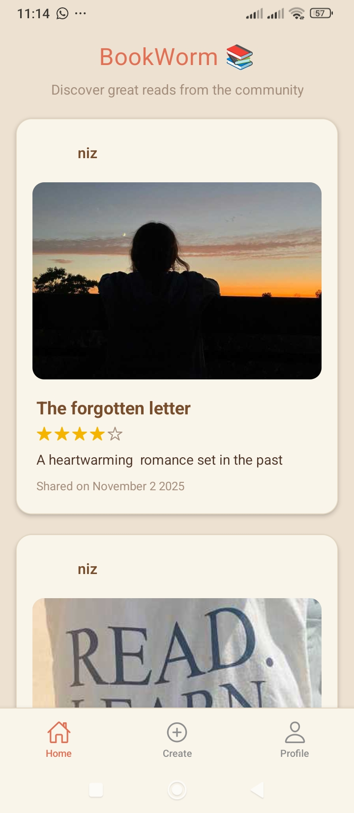
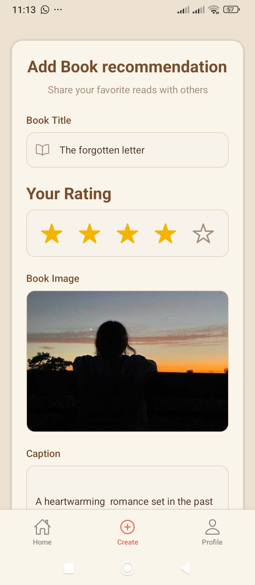
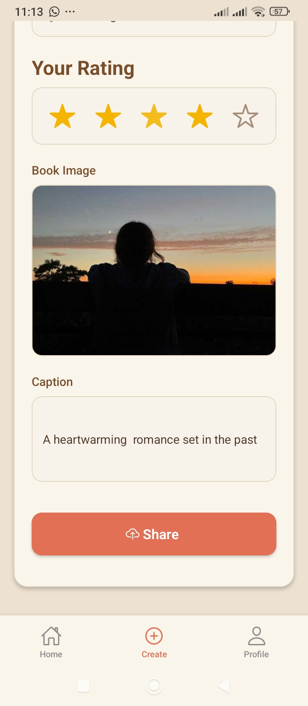
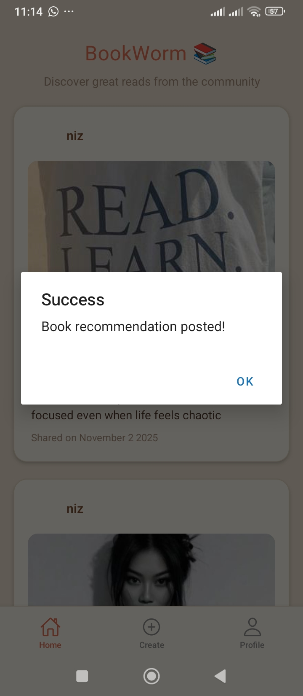
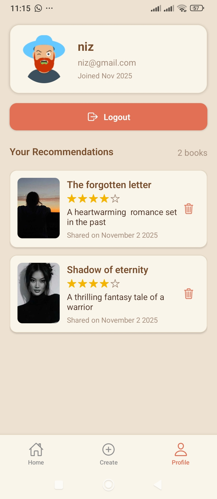
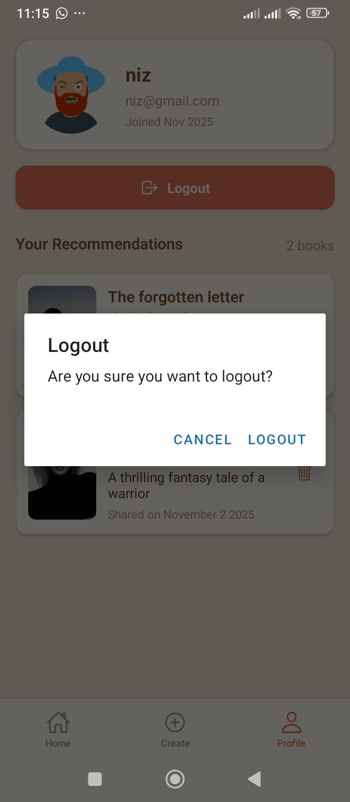

# React Native Book App 📚

A simple React Native Book Sharing App built as a **learning project** following YouTube tutorials.  
It allows users to share and view books with titles, captions, ratings, and images.

---

## Features
- View book list with images and ratings
- User profile integration
- Pull-to-refresh and infinite scroll
- Clean UI built with React Native
- Backend powered by Node.js + Express with MongoDB
- JWT Authentication for secure access

---

## Tech Stack
- **Frontend:** React Native (Expo)
- **Backend:** Node.js + Express
- **Database:** MongoDB
- **Authentication:** JWT
- **State Management:** React Hooks

---

## Screenshots

### Login


### Home / Create Account


### Book List


### Add Books




### User Profile


### New User Profile


### Delete Book


### Logout



---

## Setup Instructions

### Backend
1. Navigate to `backend` folder:
```bash
cd backend
```
Install dependencies:

```bash

npm install

```
Create a .env file and add your secrets (DB connection, JWT secret):
```
# Server Port
PORT=3000

# MongoDB connection string
MONGO_URI=your_mongodb_connection_string

# JWT secret key
JWT_SECRET=your_jwt_secret_key

# Cloudinary configuration (for image uploads)
CLOUDINARY_CLOUD_NAME=your_cloud_name
CLOUDINARY_API_KEY=your_cloudinary_api_key
CLOUDINARY_API_SECRET=your_cloudinary_api_secret

```
Start the backend server:

```
npm run dev

```
Frontend
Navigate to frontend folder:
```bash

cd mobile
```
Install dependencies:

```bash
npm install
```
Start the Expo app:
```
npm start
```
Notes
- This is a learning project, so the backend .env file is ignored for security.
- Config files contain only safe constants (e.g., BASE_URL) and are included in the repository.

---

## Author
- Tharushi Nisansala Jayarathna
(ICT Undergraduate | Uva Wellassa University)

